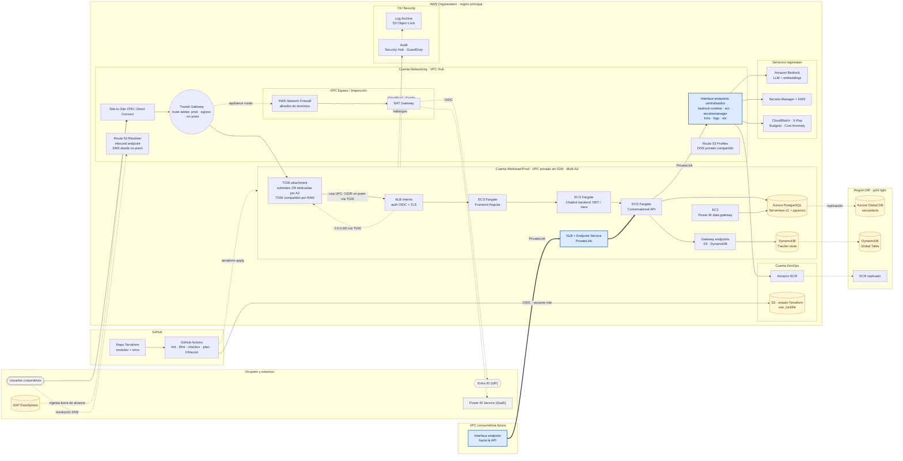
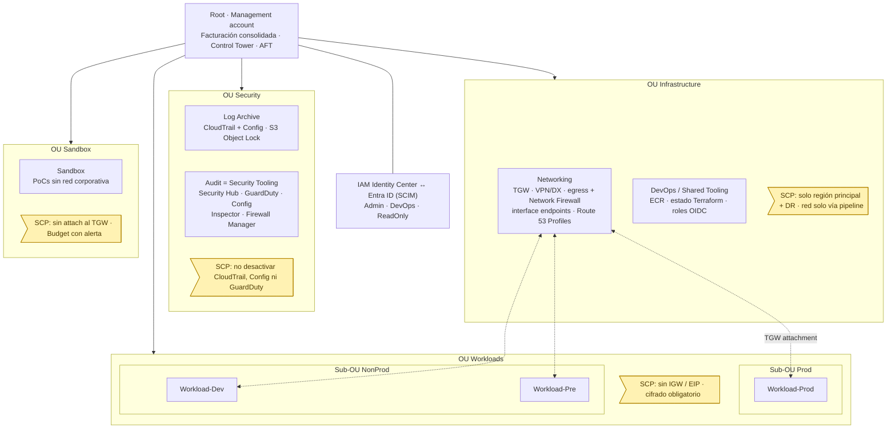

# Arquitectura – Agente conversacional en AWS

## 1. Diseño de bajo nivel (red y servicios)

```mermaid
flowchart LR
    subgraph ONPREM["On-prem y externos"]
        U(["Usuarios corporativos"])
        SAP[("SAP DataSphere")]
        ENTRA{{"Entra ID (IdP)"}}
        PBI["Power BI Service (SaaS)"]
    end

    subgraph GH["GitHub"]
        REPO["Repo Terraform<br/>modules + envs"]
        GHA["GitHub Actions<br/>fmt · tflint · checkov · plan · Infracost"]
    end

    subgraph ORG["AWS Organization · región principal"]
        subgraph NET["Cuenta Networking · VPC Hub"]
            VPN["Site-to-Site VPN / Direct Connect"]
            TGW(("Transit Gateway<br/>route tables: prod · egress · on-prem"))
            R53IN["Route 53 Resolver<br/>inbound endpoint<br/>DNS desde on-prem"]
            subgraph EGRESS["VPC Egress / Inspección"]
                NFW["AWS Network Firewall<br/>allowlist de dominios"]
                NAT["NAT Gateway"]
            end
            VPCE["Interface endpoints centralizados<br/>bedrock-runtime · ecr · secretsmanager<br/>kms · logs · sts"]
            R53["Route 53 Profiles<br/>DNS privado compartido"]
        end

        subgraph PROD["Cuenta Workload-Prod · VPC privada sin IGW · Multi-AZ"]
            TGWA["TGW attachment<br/>subredes /28 dedicadas por AZ<br/>TGW compartido por RAM"]
            ALB["ALB interno<br/>auth OIDC + TLS"]
            FE["ECS Fargate<br/>Frontend Angular"]
            BE["ECS Fargate<br/>Chatbot backend .NET / Java"]
            API["ECS Fargate<br/>Conversational API"]
            NLB["NLB + Endpoint Service<br/>PrivateLink"]
            AUR[("Aurora PostgreSQL<br/>Serverless v2 + pgvector")]
            GWE["Gateway endpoints<br/>S3 · DynamoDB"]
            DDB[("DynamoDB<br/>Tracker store")]
            PBIGW["EC2<br/>Power BI data gateway"]
        end

        subgraph DEVOPS["Cuenta DevOps"]
            ECR["Amazon ECR"]
            TFS[("S3 · estado Terraform<br/>use_lockfile")]
        end

        subgraph REGIONAL["Servicios regionales"]
            BR["Amazon Bedrock<br/>LLM + embeddings"]
            SM["Secrets Manager + KMS"]
            CW["CloudWatch · X-Ray<br/>Budgets · Cost Anomaly"]
        end

        subgraph SECOU["OU Security"]
            LOGA["Log Archive<br/>S3 Object Lock"]
            AUD["Audit<br/>Security Hub · GuardDuty"]
        end
    end

    subgraph DRREG["Región DR · pilot light"]
        AURDR[("Aurora Global DB<br/>secundaria")]
        DDBDR[("DynamoDB<br/>Global Table")]
        ECRDR["ECR replicado"]
    end

    subgraph CONS["VPC consumidora futura"]
        CEP["Interface endpoint<br/>hacia la API"]
    end

    %% Acceso de usuarios
    U --> VPN --> TGW --> TGWA -->|ruta VPC: CIDR on-prem vía TGW| ALB
    U -.->|resolución DNS| R53IN
    ALB --> FE --> BE --> API

    %% Datos e IA
    API --> AUR
    API --> GWE --> DDB
    API -->|PrivateLink| VPCE
    VPCE --> BR
    VPCE --> SM
    VPCE --> CW
    VPCE --> ECR
    PBIGW --> AUR

    %% Salida controlada
    ALB -.->|0.0.0.0/0 vía TGW| TGWA
    TGW -.->|appliance mode| NFW --> NAT
    NAT -.->|OIDC| ENTRA
    NAT -.-> PBI
    SAP -.->|ingesta fuera de alcance| VPN

    %% Exposición futura de la API
    CEP ==>|PrivateLink| NLB ==> API

    %% CI/CD
    REPO --> GHA
    GHA -->|OIDC · assume role| TFS
    GHA -.->|terraform apply| PROD

    %% DR y gobierno
    AUR -.->|replicación| AURDR
    DDB -.-> DDBDR
    ECR -.-> ECRDR
    PROD -.->|CloudTrail · Config| LOGA
    PROD -.->|hallazgos| AUD

    classDef pl fill:#DCEBFF,stroke:#1F5FBF,stroke-width:2px,color:#0B2E66
    classDef data fill:#FFF6D6,stroke:#B38600,color:#4D3A00
    classDef ext fill:#F2F2F2,stroke:#808080,color:#333333
    class NLB,CEP,VPCE pl
    class AUR,DDB,AURDR,DDBDR,TFS,SAP data
    class U,ENTRA,PBI ext
```

## 2. Landing Zone (Organizations + Control Tower)

```mermaid
flowchart TB
    ROOT["Root · Management account<br/>Facturación consolidada · Control Tower · AFT"]
    IDC["IAM Identity Center ↔ Entra ID (SCIM)<br/>Admin · DevOps · ReadOnly"]
    ROOT --- IDC

    ROOT --> SEC & INFRA & WL & SBX

    subgraph SEC["OU Security"]
        LA["Log Archive<br/>CloudTrail + Config · S3 Object Lock"]
        AU["Audit = Security Tooling<br/>Security Hub · GuardDuty · Config<br/>Inspector · Firewall Manager"]
        SCP1>"SCP: no desactivar CloudTrail, Config ni GuardDuty"]
    end

    subgraph INFRA["OU Infrastructure"]
        NW["Networking<br/>TGW · VPN/DX · egress + Network Firewall<br/>interface endpoints · Route 53 Profiles"]
        DO["DevOps / Shared Tooling<br/>ECR · estado Terraform · roles OIDC"]
        SCP2>"SCP: solo región principal + DR · red solo vía pipeline"]
    end

    subgraph WL["OU Workloads"]
        subgraph WLP["Sub-OU Prod"]
            PRD["Workload-Prod"]
        end
        subgraph WLN["Sub-OU NonProd"]
            DEV["Workload-Dev"]
            PRE["Workload-Pre"]
        end
        SCP3>"SCP: sin IGW / EIP · cifrado obligatorio"]
    end

    subgraph SBX["OU Sandbox"]
        SB["Sandbox<br/>PoCs sin red corporativa"]
        SCP4>"SCP: sin attach al TGW · Budget con alerta"]
    end

    NW <-.->|TGW attachment| PRD
    NW <-.-> DEV
    NW <-.-> PRE

    classDef scp fill:#FFF2B3,stroke:#B38600,color:#4D3A00
    class SCP1,SCP2,SCP3,SCP4 scp
```
